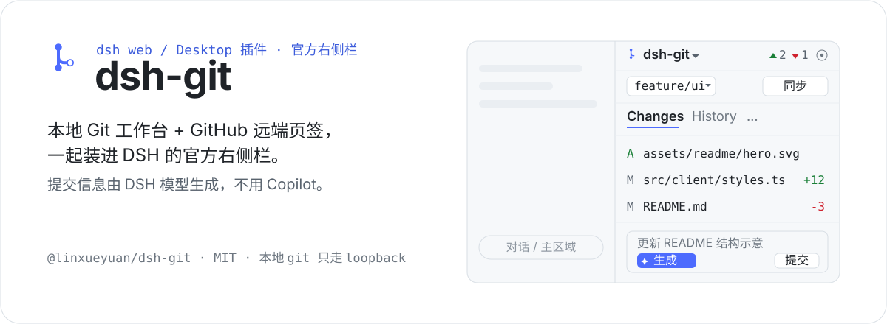
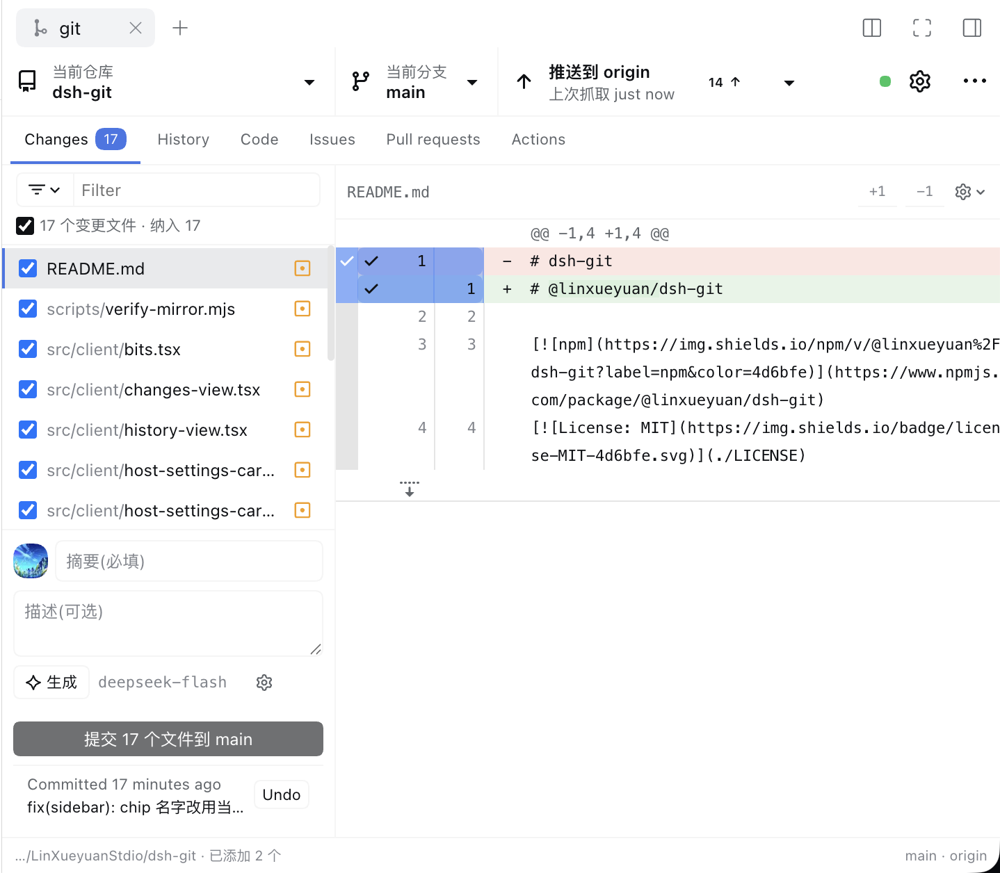
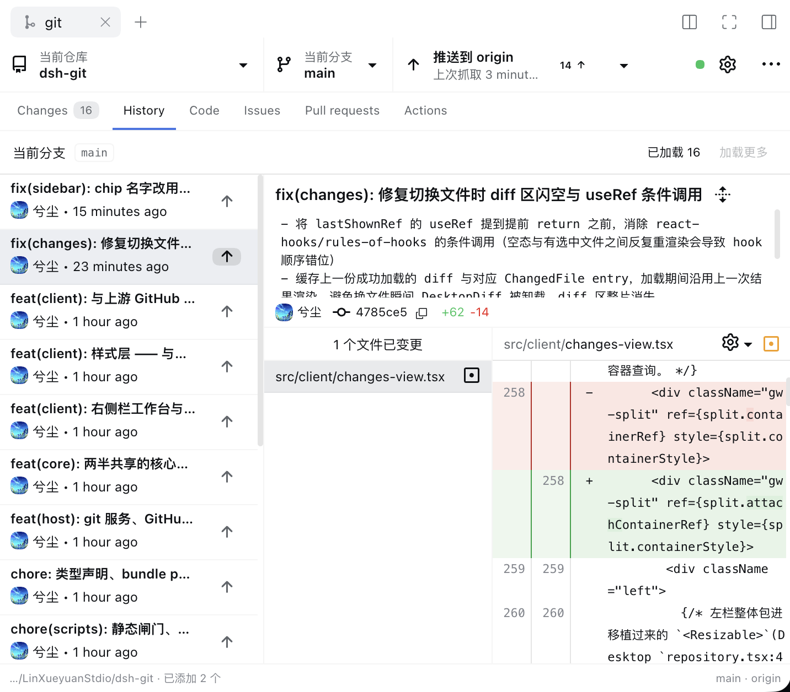
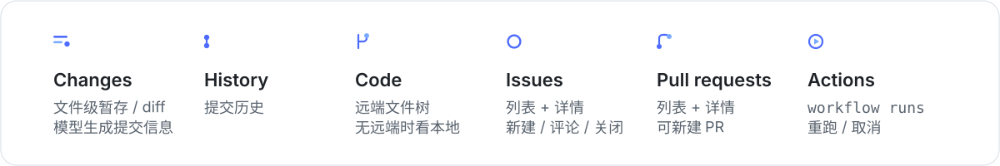
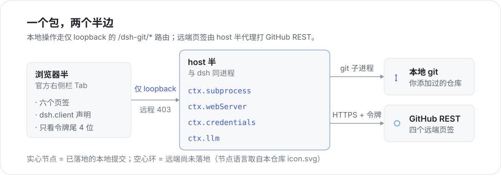

# @linxueyuan/dsh-git

[](https://www.npmjs.com/package/@linxueyuan/dsh-git)
[](./LICENSE)

<p align="center">
  
</p>

**把本地 Git 装进 [DeepSeek Harness](https://github.com/deepseek-ai/deepseek-harness) 的官方右侧栏**：多仓库下拉、Changes / History 本地操作、Code / Issues / Pull requests / Actions 远端页签，提交信息由 DSH 模型列表里的模型生成。

<p align="center">
  
</p>

<p align="center">
  
</p>

## 你会得到

<p align="center">
  
</p>

另外这些是所有页签共用的：

- **多仓库下拉** —— 你显式添加过的本地仓库；登录 GitHub 后还能列出你有权限的远端仓库。
- **同步与分支** —— fetch / pull / push；强推只允许 `--force-with-lease`（全库没有裸 `--force`）。分支可切换、新建、重命名，也能检出某个提交（分离头）或 cherry-pick。
- **没有远端也能用** —— Code 页签在本地仓库上退化为本地工作区视图，不是空页；Issues / PR / Actions 需要远端，缺远端时给的是可读说明而不是报错。
- **提交信息交给模型** —— host 半读 diff，走 `ctx.llm` 里你已经在 DSH 配好的任意 provider。
- **设置里能找到它** —— 侧栏「插件」页与「设置 ▸ 内置插件」两处都有卡片。

## 它是怎么做的

<p align="center">
  
</p>

一个 npm 包里是两个半边：**浏览器半**只画界面（注册官方右侧栏 tab，本地操作走 `/dsh-git/*`），**host 半**与 dsh 同进程，跑 git、注册路由、保管令牌、调模型。远端页签不直接打 GitHub，而是由 host 半代理，令牌因此从不进入浏览器。

- `/dsh-git/*` 只接受 **loopback** 请求；局域网 / 远程访问一律 403。
- git 只能操作**你显式添加过的仓库**清单里的路径（其他路径返回 `workspace-unknown`）。
- clone 关掉 `protocol.ext.*`。
- 令牌只存在 host，读 / 写 / 日志只有一处：`src/host/credential-bridge.ts`。

## 安装

```bash
# 从 npm 安装(npm 包名是 scoped 的 @linxueyuan/dsh-git)
dsh plugin --profile <profile> add @linxueyuan/dsh-git

# 从本地目录安装(开发态)
dsh plugin --profile <profile> add /path/to/dsh-git
```

注意是 `@linxueyuan/dsh-git` 而不是无 scope 的 `dsh-git`，后者已被他人占位（0.0.1，纯占位包，仓库链接 404）。

安装后重启 DSH 并硬刷新页面（host 半是 Node 模块，不随页面刷新重新加载）。

## GitHub 登录与令牌

默认只需要 Personal Access Token（细粒度 Token 需要 Contents R / Issues RW / Pull requests RW / Actions RW；经典 Token 用 `repo`）。想要「设备码登录」就在 profile 的 `cordis.patch.yml` 里填一个 GitHub OAuth App 的 Client ID：

```yaml
- id: dsh-git
  name: '@linxueyuan/dsh-git'
  config:
    # 自己建一个 OAuth App 即可(免费,不需要 Copilot):
    # https://github.com/settings/developers → New OAuth App
    # 勾选 "Enable Device Flow";Callback URL 可留空/随便填。
    # 设备码流程不需要 client secret,所以只放 Client ID 没有泄密风险。
    clientId: 'Iv1.xxxxxxxx'
```

不填 Client ID 时，设置里只提供 Personal Access Token 登录（功能不缺失，只是多一步）。

令牌存在哪、被什么保护：

- **它只存在 host，浏览器拿不到完整值**：挂在宿主凭据接缝 `ctx.credentials` 的 `GITHUB_TOKEN` 上（`$DSH_HOME/.credentials.yaml`），界面只显示尾 4 位；git 通过环境变量拿凭据，不进 argv、不进 `.git/config`。
- **它不在插件的通用状态域里**：整域读 / 写 / 导出 / 备份都会带上它 —— 令牌不进去。
- **`GITHUB_TOKEN=… dsh` 是只读覆盖**（写它会被拒），轮换令牌不需要改代码。
- **静止保护是明文 + 文件权限（文件 `0600` / 目录 `0700`），没有加密。** 全仓没有 `safeStorage` / `keytar`；宿主 `credentials-local` 自己的 README 就写着 OS 钥匙串 provider「deferred」「none is shipped」，而它自己的账号令牌也是明文放在同一个 `$DSH_HOME/.credentials.yaml` 里。`0600` 挡得住其他用户，挡不住同用户进程、备份工具和云同步。

## 已知边界（M1）

- M1 只做**文件级**暂存；行级/块级部分暂存（自建补丁 + `git apply --cached`）排在 M2。
- 远端页签以 GitHub 为准；本地未推送的提交在 Code 树里看不到对应文件。

## 开发

```bash
npm install           # 依赖：esbuild（打包）+ typescript / eslint / sass（闸门）
npm run build         # lib/index.js(host, esm) + lib/client.js(browser, ModuleLoader 包装)
npm run check         # 产物语法检查（node --check）
npm run lint          # ESLint
npm run typecheck     # 类型闸门
npm run check:static  # 一条命令跑齐所有静态闸门（check-all 自动发现并汇总）
```

闸门（本地与 CI 跑的是同一条命令）：

| 闸门 | 拦下的静默失败 |
|---|---|
| `check-integration` | 产物没跃升 / 镜像不可达 / 类名缺失 |
| `check-generated` | 生成物与源码不同步（`npm run check:generated:rebuild` 会重跑构建逐字节比对） |
| `check-base-recipes` | 类名在、但真正的样式配方不在编译闭包里 |
| `check-scope-roots` | 作用域根在同一条选择器里出现两次 ⇒ 永不匹配 |
| `check-sass-leaks` | 产物里残留未编码的 `$var` ⇒ 浏览器静默丢弃整条声明 |
| `check-unreachable-ancestors` | 规则在，但它要求的祖先元素从不渲染 |
| `check-lint` / `check-types` / `check-scripts-types` | ESLint / 客户端类型 / `scripts/**` 自己的类型 |

退出码契约：`0` = 通过（允许带**已登记**的棘轮债务）、`1` = 有**未登记**缺陷、`2` = 跳过。


## License

[MIT](./LICENSE)
